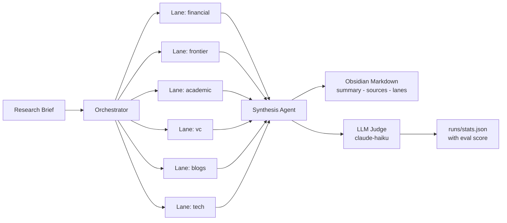

# research-sweeper

Multi-lane agentic research harness that runs parallel Claude and OpenAI agents, synthesises Obsidian-ready markdown, and scores each sweep with an LLM judge.

## What it does

- Runs up to 6 parallel research lanes (`financial`, `frontier`, `academic`, `vc`, `blogs`, `tech`) as independent Claude or OpenAI agent calls with forced `web_search_20250305` tool use on the API path.
- Synthesises lane outputs into a single Obsidian-ready summary plus a deduplicated sources file, with optional async submission through the Anthropic and OpenAI Batch APIs for cost reduction.
- Evaluates each sweep with an LLM-as-judge harness using `claude-haiku-4-5-20251001` across coverage, source quality, synthesis, and relevance, and persists scores back to the run record.

## Architecture



## Quick start (no 1Password)

```bash
cp .env.example .env
# edit .env: set ANTHROPIC_API_KEY (and OPENAI_API_KEY for the OpenAI provider)

npm install
npm run auth:check          # verifies the keys in .env work

npm run sweep -- \
  --brief-file "prompts/your-brief.md" \
  --from 2023 \
  --lanes financial,frontier,academic,vc,blogs,tech \
  --depth standard \
  --folder "your-topic"
```

`.env` is loaded fill-only and never overrides a real environment variable, so the
secure wrappers (`./batch-search.sh`, etc.) also work without 1Password — they
detect that `op-fetch` is unavailable and fall back to the `.env` keys.

Generated output defaults to `~/obsidian/research/<folder>/`; set
`RESEARCH_SWEEPER_OUTPUT_DIR` (env or `.env`) to write elsewhere.

> **Tip:** the run signature is long. Describe what you want in plain English to
> any capable LLM and ask it to emit the full `--flag` invocation (topic, lanes,
> depth, folder). Quicker and less error-prone than hand-writing the command.

### Writing a research brief

Briefs are plain markdown files in `prompts/`. A brief carries the topic string
and the themed sub-questions; `--brief-file prompts/<name>.md` passes both
through to the lane agents and the synthesis step.

Three ways, easiest first:

**1. The `sweeper-prompt-creation` skill (recommended).** If you drive this repo
from Claude Code or an MCP harness, invoke the `sweeper-prompt-creation` skill
(distributed via mcp-hub). Describe your research goal in plain English; it
interviews you for the gaps (time window, lanes, depth), writes a well-formed
`prompts/<slug>.md`, and offers to launch the sweep. This is the handiest path —
a good brief is the single highest-leverage input to a sweep.

**2. Any capable LLM.** No skill? Paste `prompts/sweep-template.md` into any
model, describe the goal, and save the returned brief into `prompts/`.

**3. By hand.**

```bash
cp prompts/sweep-template.md prompts/my-topic.md
# edit: fill in the topic string and 2–4 themes of sub-questions
```

The template documents the expected structure (topic string with a date range,
then themed sub-question blocks). The repo ships ~24 real briefs in `prompts/`
as worked examples.

## Quick start (with 1Password, optional)

```bash
cp op-refs.local.sh.example op-refs.local.sh   # set your real op:// vault refs
npm run auth:check:secure                       # resolves refs via op-fetch

./batch-search.sh \
  --brief-file "prompts/your-brief.md" \
  --from 2023 \
  --lanes financial,frontier,academic,vc,blogs,tech \
  --depth standard \
  --folder "your-topic"
```

`--brief-file` passes both the topic and the sub-questions through to lane agents and synthesis. Use `./list-batches.sh` to inspect pending jobs and `./resume-batch.sh <n>` to collect results.

## Auth routes

| Route | When to use | Credential source |
|---|---|---|
| API key (batch) | Long sweeps, async, cost-tracked | `.env`, or 1Password via `op-fetch` |
| Claude OAuth | Sync sweeps on Max/Pro quota | `CLAUDE_CODE_OAUTH_TOKEN` (`.env` or 1Password) |
| Codex auth | OpenAI sync runs, no API billing | Codex CLI auth file (`codex login`) |

1Password is optional. When configured, all `op://` references live in your
gitignored `op-refs.local.sh`; the resolver fetches only the named refs and
execs the child with a sanitised env. Without it, keys come from `.env`
(fill-only). Batch mode requires API-key auth (either source).

## Evaluation

Each sweep can be scored by an LLM judge harness using `claude-haiku-4-5-20251001`. The judge reads the summary, sources, and original brief, and returns four 1-5 dimension scores (coverage, source quality, synthesis, relevance), an overall mean, a 2-3 sentence verdict, and a list of unverifiable factual flags. Scores are computed from a single API call per sweep and persisted onto the matching `runId` in `runs/stats.json`, or written to `runs/eval-<runId>.json` if no run record exists. Run it via:

```bash
ANTHROPIC_API_KEY=... npm run eval -- \
  --summary path/to/summary-<slug>.md \
  --sources path/to/sources-<slug>.md \
  --brief path/to/brief.md \
  --run-id <optional-run-id>
```

The eval CLI requires `ANTHROPIC_API_KEY` to be injected by the caller and exits non-zero if it is absent.

## Output files

Each sweep writes to `<output-folder>/`:

| File | Purpose |
|---|---|
| `_research-sweeper-stub.md` | Placeholder written before lanes start; signals an in-flight sweep |
| `summary-<slug>.md` | Synthesised cross-lane narrative with section headings |
| `sources-<slug>.md` | Deduplicated, dated source list across all lanes |
| `lanes/lane-<name>-<slug>.md` | Per-lane markdown with narrative and citations |
| `lanes/lanes-<slug>.json` | Structured lane payload for re-synthesis and eval |

Existing `summary-*`, `sources-*`, and lane files are not overwritten unless `--overwrite` is passed. Re-synthesis is allowed to rewrite generated outputs.

## Security

No credentials are committed to the repository: `.gitignore` excludes `.env*` (except `.env.example`), `op-refs.local.sh`, and `.claude/settings.local.json`. When 1Password is configured, keys are resolved at runtime via the `op-fetch` wrapper and never touch disk; otherwise they are read from a local, gitignored `.env`. See [`docs/SECURITY.md`](docs/SECURITY.md) for the full architecture, threat model, and rotation steps.

## Development

```bash
npm run build        # compile TypeScript
npm run typecheck    # type-check without emit
npm run test         # vitest unit tests
./scripts/smoke-test.sh  # typecheck + test + build
```
