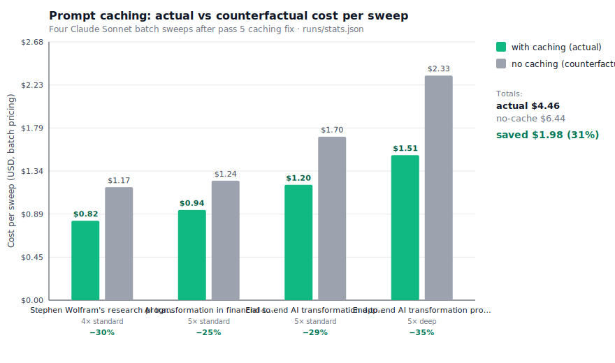

# Prompt-caching experiment results

Generated by `scripts/analyze-cache.ts` against the last four Claude batch sweeps in `runs/stats.json`.

## Per-sweep results

| Sweep | Lanes | Depth | Cache create | Cache read | Read/write | Actual $ | No-cache $ | Saved | Saved % |
|---|---|---|---|---|---|---|---|---|---|
| Stephen Wolfram's research progr… | 4 | standard | 272,461 | 334,041 | 1.23× | $0.82 | $1.17 | $0.35 | 30% |
| AI transformation in financial s… | 5 | standard | 302,152 | 309,285 | 1.02× | $0.94 | $1.24 | $0.30 | 25% |
| End-to-end AI transformation app… | 5 | standard | 413,403 | 484,673 | 1.17× | $1.20 | $1.70 | $0.50 | 29% |
| End-to-end AI transformation pro… | 5 | deep | 463,306 | 740,658 | 1.60× | $1.51 | $2.33 | $0.83 | 35% |
| **Totals** | | | | | | **$4.46** | **$6.44** | **$1.98** | **31%** |

## Pricing assumptions

- Sonnet input $3 / MTok, output $15 / MTok
- Cache write 1.25× input, cache read 0.10× input
- Batch discount 0.5× on everything
- Synthesis cost is identical between cached and counterfactual columns (only lane prompts are cached)

## Chart

